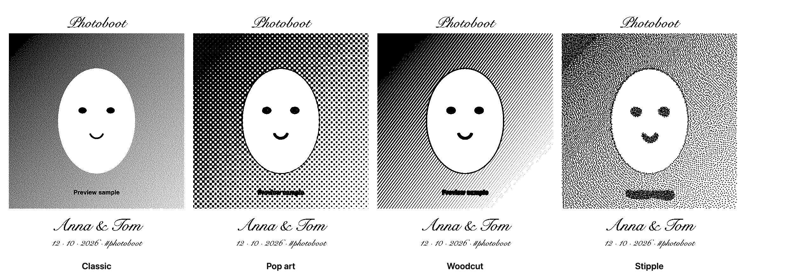

# Photoboot — a DIY photo booth that prints stickers

**Turn any laptop, tablet or Mac mini with a webcam into a party photo booth
that prints black-and-white stickers on a cheap Bluetooth thermal printer.**
Open-source, runs in the browser (PWA), self-hosted, no app to install.

[](https://boot.small-victories.co)
[](https://github.com/marijnvandevoorde/photoboot/actions/workflows/ci.yml)
[](LICENSE)




Guests strike a pose, watch the countdown, and walk away with a sticker — plus
a colour copy on their phone via a QR code. Great for weddings, birthdays,
company parties, school fairs and festivals.

**Try it now: [boot.small-victories.co](https://boot.small-victories.co)** —
open it in Chrome (Android, Mac, Windows, ChromeOS) or in
[Bluefy](https://apps.apple.com/app/bluefy-web-ble-browser/id1492822055) on
iPad / iPhone. “Start without printer” works on anything with a camera.

- 🖨️ **Prints over Bluetooth** to Phomemo P2 / P2S / M02 / M03 / M04 / T02
  thermal sticker printers, straight from the browser (Web Bluetooth).
- 🎨 **Live looks**: see the camera in Classic, Pop art, Woodcut or Stipple
  before the photo is taken, plus Mirror and Big head twists.
- 🎞️ **Photo strips** of 1–4 shots, with your own header and footer — typed
  names and date, or your own artwork.
- 📱 **QR sharing**: guests scan to get a colour copy; photos expire after
  30 days and can be deleted by the guest.
- 🎉 **Runs unattended**: auto-print, print limits, a paper-low warning, an
  idle attract screen and self-healing camera and printer connections.
- 🏠 **Self-hosted and private**: a static web app plus a tiny dependency-free
  Node server, with a Dockerfile and Compose setup.

## What guests get

- A live camera with a big countdown (3 / 5 / 10 s), beeps, a flash and a
  cancel button. Tap anywhere to start.
- Single shots or photo strips of 2–4 shots, with “Photo 2 of 3 · Next pose!”.
- Looks — Classic, Pop art, Woodcut, Stipple — and twists — Mirror, Big head —
  shown **live on the camera** before the photo is taken.
- A review screen that shows the sticker exactly as it will print, then
  Print, Get photo (QR to a colour copy), Retake or Done.
- English, Dutch or French, or your own wording for every message.

## What the host gets

- **Templates**: plain, a typed title / names / date / hashtag, or your own
  header and footer images.
- **Unattended mode**: auto-print, copies per print, a print limit per photo,
  an idle “tap to take your photo” screen that cycles recent photos, and
  friendly error screens that recover by themselves when the camera or
  printer drops out.
- **Paper meter**: set the roll length and the booth warns you (not the
  guests) when it's running low.
- **Counters**: sessions, prints, shares and the busiest hour, per event.
- **Every photo kept**: a colour copy of every session in the browser, ready
  to download as a ZIP the next morning.
- **Saved setups**: save, export and import whole setups (settings and
  template images) as a file.
- **Event galleries** (paid): a host creates an event, gets a setup link
  for every booth and a private gallery with a ZIP of all shared photos,
  kept for a year. In the iOS app it's an in-app purchase right in
  settings. The owner manages events in `/admin` (admin token +
  authenticator code).

- **Guest-proof kiosk**: once started, the booth stays on the camera — a
  reload or app restart comes straight back and reconnects to the same
  printer by itself (Chrome and the app). Leaving the booth needs the host
  PIN. No pull-to-refresh, zoom or long-press menus. For a fully locked
  tablet, use iPad Guided Access or Android app pinning.

Settings live on a hidden page, grouped for hosts (Tonight, Event, What
guests see, Printer & paper, Photos, Security, Advanced) with a short
explanation under every setting. To get there: long-press the “Photoboot”
title on the start screen, or long-press the top-left corner of the camera
view for 2 s for the host menu (settings, change printer, stop booth). Both
ask for the PIN when one is set; `/?admin=1` opens settings behind the same
PIN. **Stop booth** (host menu or Settings → Security) brings back the
start screen.

## Hardware

- **Printer**: Phomemo P2 / P2S / M02 / M03 / M04 / T02 family over
  Bluetooth Low Energy (300 dpi, 576-dot head). Other printers can be added,
  see [Adding a printer](#adding-a-printer).
- **Paper**: the default is a 53 mm roll with 50 mm stickers (552 dots wide).
  Other widths are a setting; `/test.html` prints calibration rulers.
- **Camera**: any webcam or built-in camera. The booth asks for 1280×960 at
  30 fps, which is plenty for a 50 mm sticker.
- **Browser**: Web Bluetooth is needed for printing — Chrome / Edge on
  Android, macOS, Windows, ChromeOS, or Bluefy on iOS. Safari and Firefox
  can run the booth without a printer.

## Run it locally

```sh
./run.sh          # downloads a portable Node into ./.node, then starts Vite
```

That serves the booth over HTTPS on your LAN (accept the self-signed
certificate) at `https://<this machine>:5173`. Camera and Bluetooth both need
HTTPS or `localhost`. Shared photos land in `./shares`.

Other scripts: `./run.sh build` builds into `dist/`; `./print.sh` opens a page
to print a single photo from this computer.

## Develop

TypeScript (strict) with no framework, built by Vite, linted and formatted
by Biome, tested with Vitest. The server runs its `.ts` files directly on
Node 24 — no build step.

```sh
npm ci
npm run dev        # Vite dev server with HTTPS + the share/event API
npm run check      # typecheck + lint + unit/server tests
npm run test:e2e   # builds, then drives headless Chrome with a fake camera
                   # and a fake Bluetooth printer (needs Google Chrome)
npm run format     # Biome: format + safe fixes
```

Tests need Node 22+. Running the booth itself only needs Node 20.19+
(`./run.sh` picks the right Node for older Macs).

## Host it

The production server is plain Node (no dependencies) serving `dist/` plus
the share and event routes. With Docker:

```sh
docker compose up -d --build
```

`docker-compose.yml` is set up for a Traefik reverse proxy; adapt the labels,
domain and volumes to your host. `./deploy.sh user@host` copies the project
over SSH and runs Compose there.

| Variable         | Default       | What it does                                                        |
| ---------------- | ------------- | ------------------------------------------------------------------- |
| `BASE_URL`       | from request  | Public origin used in QR links, e.g. `https://booth.example.com`     |
| `PORT`           | `8080`        | HTTP port                                                            |
| `SHARE_DIR`      | `./shares`    | Where shared photos are stored                                       |
| `EVENTS_DIR`     | `./events`    | Where server events are stored                                       |
| `SHARE_TTL_DAYS` | `30`          | Shared photos are deleted after this many days (`0` = never)          |
| `SHARE_MAX_MB`   | `5000`        | Refuse uploads once the photo folder is this big                     |
| `ADMIN_TOKEN`    | —             | Enables `/admin` (log in with it + an authenticator code)            |
| `ADMIN_TOTP_RESET` | —           | `1` forgets the enrolled authenticator (next login sets up a new one) |
| `PUBLIC_URL`     | `BASE_URL`    | Origin used in emailed setup / gallery links                         |
| `PAID_RETENTION_DAYS` | `365`    | How long a paid event keeps its photos                               |
| `EVENT_PRICE_CENTS` | `1900`     | Web price of an event gallery, in cents                              |
| `EVENT_CURRENCY` | `eur`         | Currency of that price                                               |
| `APPLE_BUNDLE_ID` | `co.smallvictories.photoboot` | iOS app whose in-app purchases are accepted               |
| `APPLE_PRODUCT_ID` | `co.smallvictories.photoboot.eventgallery` | The consumable that buys an event gallery |
| `APPLE_ALLOW_SANDBOX` | `1`      | Accept Sandbox purchases (TestFlight, sandbox testers); `0` = Production only |
| `BREVO_API_KEY`  | —             | Sends the event emails through Brevo (without it they're logged)     |
| `MAIL_FROM`      | `booth@small-victories.co` | Sender address (a verified Brevo sender)                |
| `DB_PATH`        | `EVENTS_DIR/photoboot.db` | SQLite database (events, photos, payments, sessions)     |
| `UPLOAD_TOKEN`   | —             | If set, uploads need this token (set it in settings) or an event key |

Put the secrets in a `.env` next to `docker-compose.yml`.

### In-app purchase (iOS)

Inside the iOS app, an event gallery is sold through Apple in-app purchase
(App Store guideline 3.1.1); the web keeps its own checkout. The app asks the
server for a pending event, buys the consumable with that event's
`appAccountToken`, and sends the signed StoreKit 2 transaction to
`/api/apple/redeem`. The server verifies Apple's signature and certificate
chain itself (pinned Apple Root CA - G3, `server/apple-root-ca-g3.pem`) and
activates the event; the host gets the usual email and the booth sets itself
up right away. To set it up:

1. **App Store Connect → the app → In-App Purchases**: create a
   **Consumable** with product id `co.smallvictories.photoboot.eventgallery`
   (or set `APPLE_PRODUCT_ID` on the server and `VITE_APPLE_PRODUCT_ID` when
   building the app), a price, a display name and description, and a review
   screenshot of the settings card. Submit it together with the next app
   version.
2. **App Information → App Store Server Notifications**: Version 2, with
   `https://<host>/api/apple/notifications` as both the Production and the
   Sandbox URL. Refunds then end the paid perks, and a purchase whose app
   never got back to the server still activates its event.
3. **Agreements, Tax, and Banking**: the Paid Apps agreement must be active.
   Join the **App Store Small Business Program** (15% commission instead of
   30% under $1M a year).
4. Test with TestFlight or a sandbox account: those purchases are Sandbox,
   accepted unless `APPLE_ALLOW_SANDBOX=0`.

## Privacy

Only photos a guest chooses to share leave the booth. Each shared photo gets
an unguessable link and a page where the guest can save it or delete it, and
it's deleted automatically after `SHARE_TTL_DAYS`. Images are served with
`Cache-Control: private`, so a CDN doesn't keep copies after a delete.
Uploads are rate-limited per IP unless they come from a booth with a valid
event key. Everything else — settings, counters, the full photo archive —
stays in the booth's browser.

## Adding a printer

Printers are pluggable. Subclass `PrinterBase` in `src/printers/<brand>.js`
(connect, init, printRaster, feed), register it in `src/printers/index.js`
with its Bluetooth name prefixes and service UUIDs, and it shows up in
settings and in auto-detect. The Phomemo protocol notes are in
[CONTEXT.md](CONTEXT.md).

## How it's built

TypeScript and Vite, no framework. Photos are dithered to 1-bit in
the browser (`src/raster.js`, `src/effects.js`), composed with the template
(`src/strip.js`) and sent to the printer as ESC/POS raster commands over
Web Bluetooth. [CONTEXT.md](CONTEXT.md) has the full map of the code, the
printer protocol and the decisions behind it.

## License

[MIT](LICENSE) © Marijn Van de Voorde
